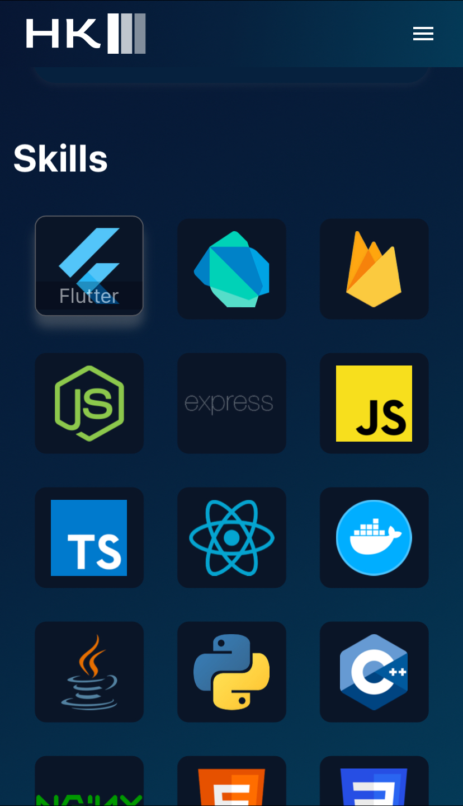
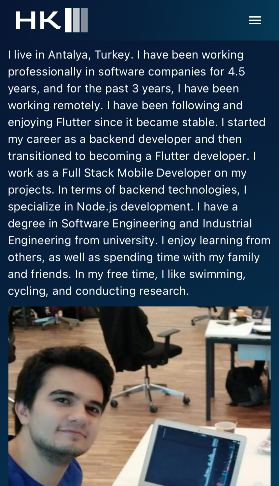

<h2 align="center">
  Portfolio<br/>
  <a href="https://hasankarli.com/" target="_blank">hasankarli.com</a>
</h2>


# Description

Hello! I'm Hasan Karli, a Flutter developer, and this website is a platform where I showcase my own work. I specialize in mobile app development using Flutter technology, and here you can find the projects I have created. Feel free to explore to learn more about my experiences and skills, and to discover potential collaboration opportunities. Thank you!

## Getting Started

- Clone down this repository
- ```flutter pub get```
- ```flutter run```


## Screenshots

    


### Show your support

Give a ⭐ if you like this website!

<a href="https://www.buymeacoffee.com/karlihasan" target="_blank"></a>
